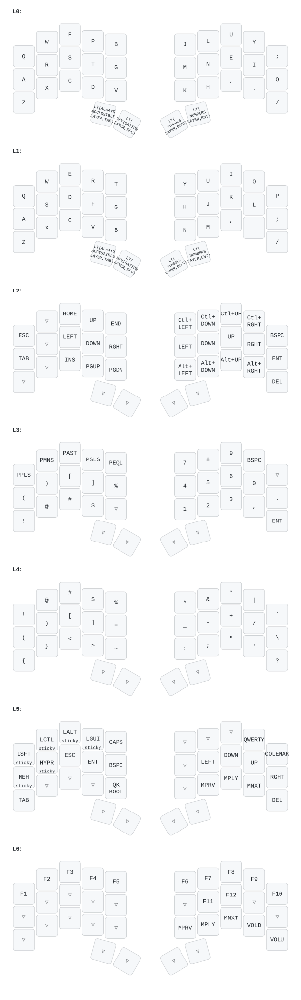

# christnil3 Ferris Sweep keymap (first draft)

This is a first-draft evolution of `christnil2` focused on three goals:

- Easier to use day-to-day.
- Fewer layers than `christnil2`.
- No home-row mods on alpha keys.

## Build and flash

### Install QMK
```sh
brew install qmk/qmk/qmk
```

### Setup QMK (one-time)
```sh
qmk setup
```

### Compile
```sh
qmk compile -kb ferris/sweep -km christnil3
```

For Elite-Pi (`.uf2` output):
```sh
qmk compile -kb ferris/sweep -km christnil3 -e CONVERT_TO=elite_pi
```

### Flash
```sh
qmk flash -kb ferris/sweep -km christnil3
```

For Elite-Pi, copy the generated `.uf2` file to the board's USB mass-storage drive in boot mode.

## Layer overview

- `0`: Colemak-DH base
- `1`: Navigation/editing
- `2`: Numbers (numpad-style)
- `3`: Symbols (single layer, no left/right split)
- `4`: Always-accessible utilities and one-shot modifiers
- `5`: Function + media (tri-layer)
- `6`: QWERTY base

Compared to `christnil2`, this removes dedicated mouse and split-symbol layers and leans on thumbs for access.

## Base layer behavior

The alpha rows are plain Colemak-DH (no mod-tap home row).

Thumb keys do most of the work:

- Left outer thumb: `Tab` tap, Always-accessible hold (`LT(4, KC_TAB)`)
- Left inner thumb: `Backspace` tap, Navigation hold (`LT(1, KC_BSPC)`)
- Right inner thumb: `Space` tap, Symbols hold (`LT(3, KC_SPC)`)
- Right outer thumb: `Enter` tap, Numbers hold (`LT(2, KC_ENT)`)

This keeps your primary layer switching on strong thumb keys, as requested.

## Why these design choices

- **No home-row mods:** all alpha keys are tap-only letters for cleaner typing feel.
- **Easy nav/edit:** holding backspace gives a navigation layer with arrows on both hands (including a full left-hand cluster with `Left/Down/Right` around `Down`), plus dedicated `Backspace` (top-right), `Enter` (below it), `Delete` (bottom-right), `PgUp/PgDn` on the left bottom-right, and right-hand `Ctrl`/`Alt` arrow chords in matching positions.
- **Numpad-style numbers:** digits are grouped on the right hand in a numpad-like cluster, while the left hand holds operators and common paired symbols.
- **Single symbol layer:** both left and right symbol families are available on one layer, avoiding left/right symbol-layer mode switching.
- **Always-accessible actions:** a dedicated thumb-held layer exposes one-shot `Cmd/Ctrl/Alt/Shift`, plus `Meh`, `Hyper`, `Caps`, media keys, and base-layout toggles.
- **Hard-access function/media layer:** holding both Navigation and Numbers together activates function/media (tri-layer), so `F` keys exist but stay out of the way.

## QWERTY swap (optional)

The Always-accessible layer includes persistent base toggles:

- `QWERTY` sets default layer to QWERTY.
- `COLEMAK` sets default layer back to Colemak-DH.

These are persistent via `set_single_persistent_default_layer`, so they survive reboot.

## Notes for iteration

This is intentionally a first draft. After some real typing time, likely tweaks are:

- Move arrow cluster location in Nav layer.
- Rebalance specific symbols based on your coding/writing frequency.
- Adjust `TAPPING_TERM` if thumb holds trigger too easily or not easily enough.

## Layout preview

<!-- layout-preview:start -->

<!-- layout-preview:end -->
